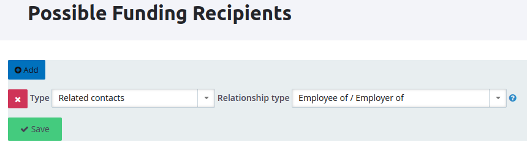
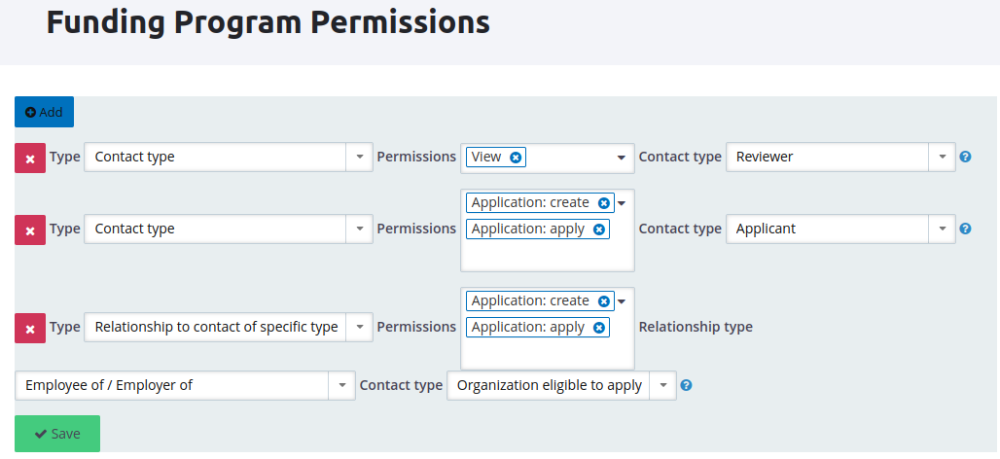
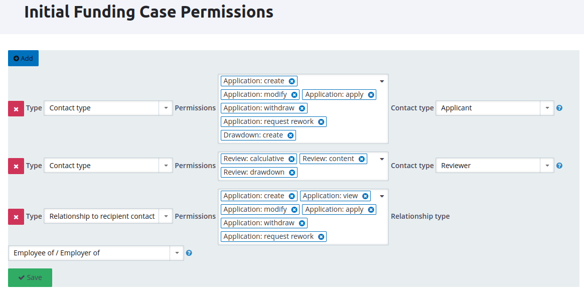

# Users and Permissions

In a funding program and for a specific funding case, different people from the giving organisation might be involved. If the receiving contact is an organisation, there might be different people interacting with the funding case as well. These people have different roles that come with different permissions.

The permissions need to be configured on different levels:

* Drupal permissions
* CiviRemote User roles on a CiviCRM contact summary page
* Funding program permissions
* Allowed recipients for a funding program
* Funding Case permissions

Some permissions need to be configured only once at the initial configuration of the funding framework. Others have to be configured during the creation of a new funding program. Some have to be configured for every individual contact.

## Drupal Permissions

After installing the funding extension, the Drupal roles need to be given the correct permissions. You can edit the Drupal permissons at **People > Permissions** or `/admin/people/permissions`, respectively.

* Assign this permission to  to the role `CiviRemote: CiviRemote Funding`:
    * CiviRemote Funding: Access CiviCRM Funding
* Reviewers need to have a role that grants the following permissions:
    * CiviCRM: access Funding Program Manager
* Funding Admins need to have a role that grants the following permissions:
    * CiviCRM: access Funding Program Manager
    * CiviCRM: Funding Program Manager Administration

If you don't need to differentiate, reviewer and funding program admin permissions can also be combined in one role.

## CiviRemote User Roles

Every person you want to give any of the permissions listed above needs to have a Drupal user account. This refers to reviewers of the giving organisation as well as individuals or members of external organisations that want to apply for the funding. You manually need to add CiviRemote roles to these user accounts.

Every Drupal user is mapped to a CiviCRM contact. To assign a CiviRemote role, open the summary of the CiviCRM contact and edit the field set **RemoteContact Information**.

- for reviewers add the role **CiviRemote User**.
- for receiving contacts add the roles **CiviRemote User** and **CiviRemote Funding**.

The CiviRemote User Roles are automatically synchronised with the Drupal user account during login. If there are problems with the synchronisation, open the Drupal user overview at `admin/people`. Select the user that you want to assign the roles to and perform the action **CiviRemote: Match contact(s)** and afterward **CiviRemote: Synchronise CiviRemote roles**.

## Funding Program

After creating a funding program, it will be listed at **Funding > Funding Programs**. There are several actions available, namely **Edit Recipients**, **Edit permissions** and **Edit initial funding case permissions**. These three settings have to be configured correctly before opening the program for applicants.

### Edit Recipients

When an applicant creates an application, one field of the application form asks who is going to be the recipient of the funding. The recipient is not necessarily identical to the applicant. The field in the application form is a dropdown menu where the correct recipient needs to be chosen. The values that are shown in the dropdown menu need to be configured at **Edit Recipients**.

As an example, consider a funding program that funds organizations. The application is not created by the organization but by an employee of that organization. In this case, the applicant is the employee and the recipient is the organization. If both exist as contacts in CiviCRM and are connected by a relationship of type _Employee_, the configuration would look as follows:



The dropdown menu will then show all organizations that have an _Employee_ relationship with the applicant that is logged in and creating the application.

### Edit Permissions

These permissions are related to a funding program, independently of a specific funding case or application.

The following permissions exist:

* **Application: create** allows contacts to create a new application for this funding program.
* **Application: apply** allows contacts to create a new application and apply it in one step.
* **View** specifies which funding programs are visible in the CiviCRM funding program list.

The permissions **Application: create** and **Application: apply** are granted to applicants. The **View** permission is typically given to reviewers and funding admins.

Some Drupal roles automatically imply funding program permissions. Users with the permission **CiviCRM: administer Funding Program Manager** (or **CiviCRM: administer CiviCRM**) implicitly have the **View** permission.

Permissions can be assigned to specific contacts, contact types or contacts that have a relationship to a specific contact or contact type. In the last case, you need to specify the relationship type.

A configuration could look like this:



### Initial Funding Case Permissions

Additional to the permissions that are set for a whole funding program, there exist permissions that are on the level of a funding case and can be different between cases. Funding cases are created automatically during the application process and there might be many cases for one funding program. This requires a default set of permissions that are automatically assigned during the creation of a new funding case. These initial permissions can be configured with the action **Initial funding case permissions** of a funding program. To alter the permissions for a specific funding case, go to **Funding > Funding Cases**, find the funding case in the list and choose the action **Edit permissions** for this case.

The following permissions exist for reviewers:

* Review: content
* Review: calculative
* Review: drawdown

The following permissions exist for applicants:

* Application: create
* Application: view
* Application: modify
* Application: apply
* Application: withdraw
* Application: request rework
* Drawdown: create

As before, permissions can be assigned to specific contacts, contact types or contacts that have a relationship to a specific contact or contact type. In the last case, you need to specify the relationship type.

A configuration could look like this:



In case the initial funding case permissions are changed later, the permissions
of all  existing funding cases can be reset on CLI. To do this run `cv cli` and
execute this function:

```php
> funding_case_reset_permissions();
```

An APIv4 where array for the `FundingCase` entity may be given as argument to
limit the funding cases to which the operation is applied. Depending on the
number of funding cases this might take a while.
