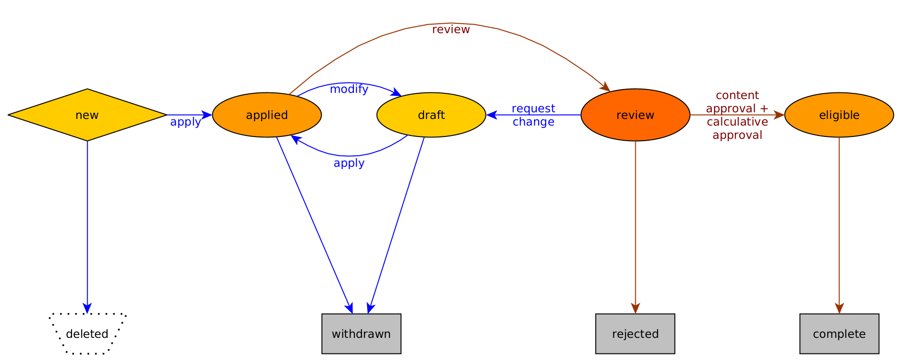
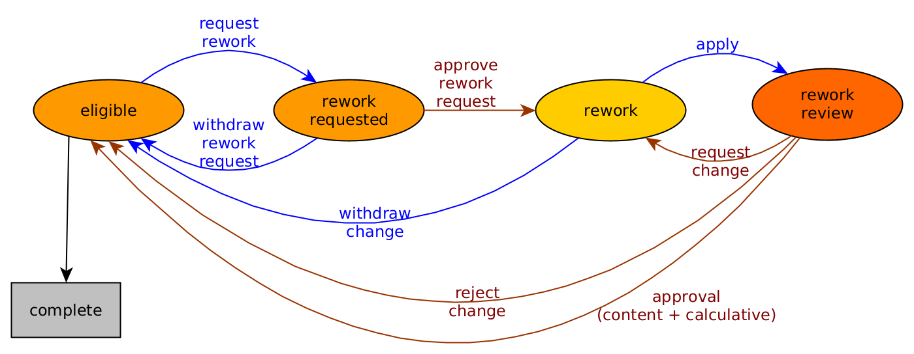

# Application States

An application goes through different states during the application phase. Depending on the current status, different actions are allowed for external applicants and internal reviewers. In some states, a reviewer or applicant can leave a comment which can be seen in the application history as well.

## Main application states

This figure shows the typical development of the states of an application of funding case type AVK1 or IJB. Actions available to applicants are marked in blue, actions available to reviewers are marked in brown. For simplicity, actions that do not change the status of an application or are unusual are omitted.

This is the full list of available actions depending on the state of an application:

| Status of the application | Action available to applicants | Actions available to reviewers                                                                           |
| ------------------------- | ------------------------------ | -------------------------------------------------------------------------------------------------------- |
| new                       | save, apply, delete            | \-                                                                                                       |
| applied                   | modify, withdraw               | review                                                                                                   |
| draft                     | save, apply, withdraw          | review                                                                                                   |
| review                    | request rework                 | update, reject, request change, approve content, reject content, approve calculative, reject calculative |
| eligible                  | see below                      | see below                                                                                                |

The states _withdrawn_ and _rejected_ do not allow for further actions.

If a funding case is approved by the reviewers, the status of all _eligible_ applications that belong to that funding case changes to _complete_ .

In the _complete_ status, any changes are possible, except the deletion of cost items. The changes have no influence on the application status or
the results of the review.

## Rework an eligible application

The figure above is not complete. It is possible for applicants to edit an application that is already approved and has the status _eligible_. This requires an additional review and therefore a series of other possible states for an application.

As above, actions that don't change the status of the applications are not shown in the figure.

This is the full list of available actions depending on the state of the application:

| Status of the application | Actions available to applicants | Actions available to reviewers                                                                                  |
| ------------------------- | ------------------------------- | --------------------------------------------------------------------------------------------------------------- |
| eligible                  | request rework                  | \-                                                                                                              |
| rework requested          | withdraw rework request         | approve rework request                                                                                          |
| rework                    | save, apply, withdraw change    | review                                                                                                          |
| rework review             | \-                              | update, reject change, request change, approve content, reject content, approve calculative, reject calculative |

