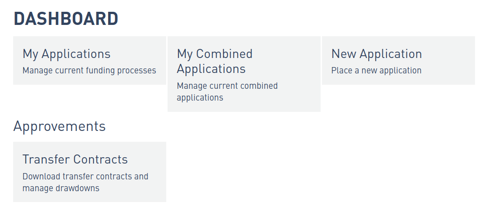
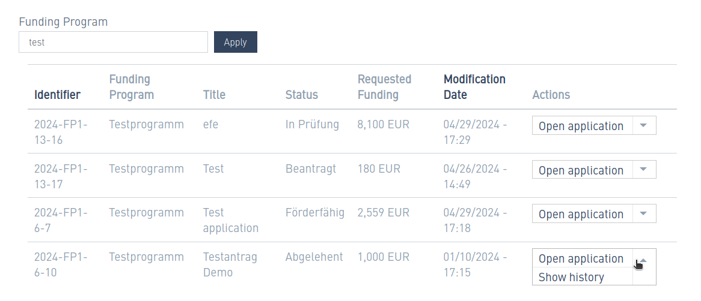
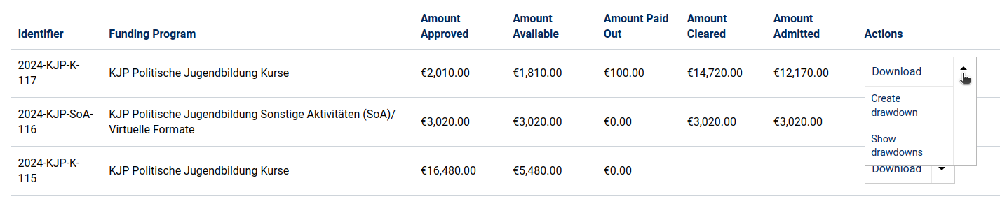
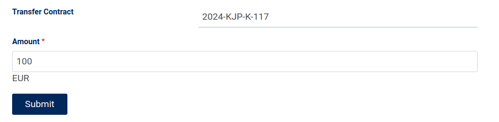
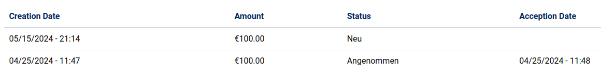

# Usage for applicants

This section describes the typical usage of the funding portal for persons who apply to the funding program. This includes the application process as well as the workflow after a funding has been granted.

The actions described below are grouped into the various [phases](./usage.md#phases-of-a-funding-case) that a funding case can go through.

## Funding Portal

### Login

Before an application can be created, applicants need to be provided with a username and password to log into the funding portal.  Their user account needs to have the correct permissions, see the section [User Permissions](../administration/user-permissions.md) for more details.

After login in, applicants can change their password at **My account** → **Edit**. All other possible actions can be found on the dashboard page.

## Dashboard

The dashboard is the central page of the funding portal and is usually configured to be the home page. All possible actions that are available to applicants are listed there.

{ width="500" }

### Application list

The dashboard element **My Applications**  shows the existing applications with some details. Different actions can be performed for applications in this list.

Applications of funding case type _Sammelantrag_ are listed separately in the dashboard element **My combined Applications**.

#### Create and upload documents

Some actions that are listed in the application list have names of the form **Create: ...**. Those actions lead to pdf documents that were created by the giving organization. They can be downloaded and printed. After filling them out you can upload them to the appropriate place, for example the application or the drawdown form.

An example use case is a confirmation of the accuracy of the data that needs to be signed by hand. This could be uploaded to the application form. Or a list of participants of a workshop, that needs to be submitted during the clearing phase.

_It is possible to upload documents to the application form._

## Application phase

### Create a new application

Applicants can create a new application by opening the dashboard and choosing **New Application**. The first step is to choose the funding program they want to apply for. This leads to the application form which can be long and divided into multiple tabs.

It is possible to save a draft and continue to work on the application at another time. When it is finished, it can be submitted by clicking on the button **Apply**.

### Change an application

You can open the application from the application list via the action **Open application**. This leads to the same form that was used during creation, containing the details of the application. However, the available buttons and associated actions in this form depend on the status that the application currently has. It could be that the application has a status that does not allow for changes.

Before applying, there are two actions possible that are reflected in the buttons available at the bottom of the form: **Save** the application after editing, or **Apply** to submit the application. If the application is in the status _review_, there will appear instead another button, namely **Request Change**.

All possible states and the available actions are explained [here](./application-states.md).

### View the application history

The applications listed in **My Applications** also allow for the action **Show History**. This leads to a flow chart showing every status that the application has gone through in chronological order, including comments created by the reviewers.

It is possible to hide all comments or to hide all workflow actions.

{ width="500" }

## Drawdown Phase

Once a funding application has been approved, the drawdown phase begins. The dashboard element **Transfer Contracts -
Download transfer contracts and manage drawdowns** leads to a list of eligible applications and provides different actions.

### Transfer contracts

A transfer contract is signed between the giving organization and the recipient. The document is uploaded by the giving
organization and available for **Download** for every eligible application.

### Drawdowns

There are two actions available: **Create drawdown** and **Show drawdowns**. It is possible to create multiple drawdowns, which allows the distribution of the available amount in several steps.

The creation of a drawdown is a very simple webform:

The action **show drawdown** leads to a list such as this:

## Clearing Process

**Important**: The implementation of the clearing process is still under development. A description of the usage will be added later.

