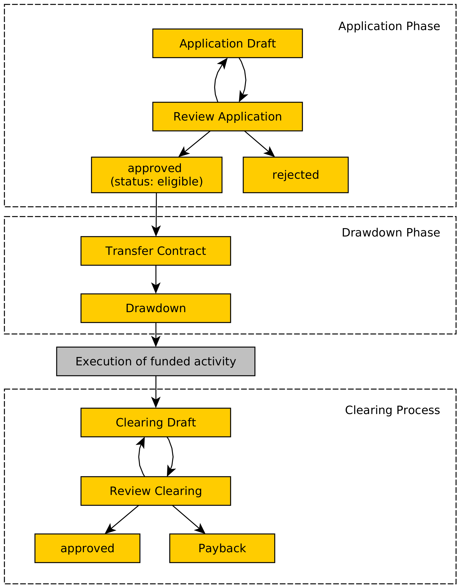

# Usage

The user experience of the funding framework depends in detail on the funding case type that is selected for the funding program. As described [here](../administration/necessary-adjustments.md), organizations that want to use the funding framework should define their own funding case type.

This chapter is based on the funding case type _Sonstige Aktivität_ (AVK1).

## Phases of a Funding Case

The workflow that a funding case goes through is visualized in a simplified version by the following diagram:

{ width="500" }

The process can be divided into three phases: the application phase, the drawdown phase and the clearing process. There are different tasks and possible actions for applicants and reviewers during those phases.

The phases might overlap each other despite being depicted separately in the diagram.
Drawdowns can be submitted during the execution of the funding activity and proofs for the clearing draft can be uploaded before the drawdown phase is finished. Consider for example a funding activity that consists of a series of workshops. Then it is possible to withdraw money and upload a proof over how the money was used for every workshop separately.

**Important**
The funding framework is still under development. The implementation of the clearing phase is currently a work in progress. Some of the depicted functionalities in this phase do not exist yet.
